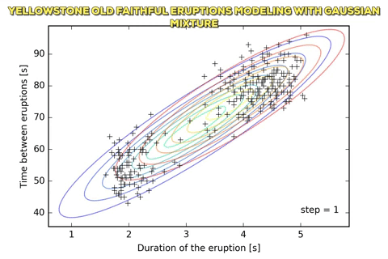

# Old faithful geyser eruption modeling ~
Modeling eruptions of the Old Faithful geyser from the Yellowstone park with Expectation Maximization which is an iterative algorithm that allows to find the maximum likelihood parameters of a probabilistic model -here a bidimensional normal distribution-  when the latter depends on unobservable latent variables.

### References ~
https://fr.wikipedia.org/wiki/Old_Faithful
https://en.wikipedia.org/wiki/Multivariate_normal_distribution
https://en.wikipedia.org/wiki/Expectation%E2%80%93maximization_algorithm
